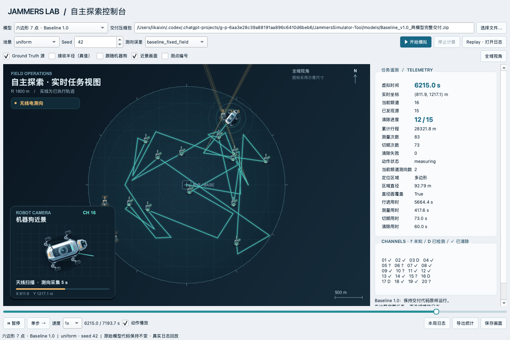

# Jammers Lab — enhanced testing and continuous desktop animation

This platform adds an observer-only PySide6 desktop application, reproducible mock,
unchanged Baseline 1.0 execution, Q1 integration demo and saved event replay without
changing the original CLI/MCP. The Q1 demo calls the adjacent
`CUMCM-2026/code/第一问.py::localize(measurements)` without editing that model or any
paper content. Baseline runs use the original Q1 file inside the supplied model ZIP.
See [COMPATIBILITY.md](COMPATIBILITY.md)
for assumptions, rounding boundaries, and incomplete official behavior.



A saved demonstration is included: `python -m enhanced gui --replay examples/enhanced-demo`.
This replay works without the adjacent Q1 repository.

## Baseline 1.0 原代码模拟

已支持原交付包中的六边形 7 点与螺旋 12 点模型。界面顶部选择模型和 ZIP，点击
**开始模拟**，计算后自动播放。原模型代码和配置均保持不变。
参见 [原代码核对与操作说明](docs/BASELINE_INTEGRATION.md)。

```sh
python -m enhanced baseline --model hexagon_v1 --seed 42 --error-model baseline_fixed_field
python -m enhanced baseline --model spiral_v1 --seed 42 --error-model baseline_fixed_field
```

## Setup and launch

Use Python 3.10+. Baseline simulation needs the original supplied ZIP; Replay
needs only a saved run. For the Q1 integration demo, place the two repositories
adjacent:

```text
workspace/
  CUMCM-2026/code/第一问.py
  JammersSimulator-Tool/
```

From `JammersSimulator-Tool`:

```sh
python -m venv .venv
# macOS:
source .venv/bin/activate
# Windows PowerShell instead:
# .venv\Scripts\Activate.ps1
python -m pip install -r requirements-enhanced.txt
python -m enhanced gui
```

Select model, scenario, seed and error model, then press **开始模拟**. Playback starts automatically after calculation.
The dog starts at (0,0) and moves continuously at 5 m/s virtual speed. Playback
speeds: 0.5/1/2/5/10/20/50×. Pause, step to the next event completion, or drag the
timeline in either direction. Wheel zoom and drag pan; **全域视角** restores the arena.
The map uses east +x, north +y. Truth and reception radii are observer overlays;
only observations and localization results reach the strategy.

## 动画与界面操作

地图现在绘制带机身、关节、四足、传感器和天线的机器狗，以及带频道标识的信号设备。
机器狗沿已执行路线连续行进，朝向随路线改变，行进时四足交替摆动；测量时有天线旋转、
扩散波纹和扫描效果。右侧遥测与底部虚拟时间同步更新。深色地图含坐标网格、圆域边界、
起点停靠标记、指北针和随缩放变化的比例尺。

**初次观看：**选择六边形或螺旋模型及原 ZIP，保留默认误差模型，点击 **开始模拟**。
计算完成后自动播放。默认启用 **近景画面** 和 **动作慢放**，默认速度为 20×；
可改为 50× 快速看完整路径，或暂停后查看定位细节。

| 控件 | 作用 |
|---|---|
| 播放 / 暂停；空格键 | 控制当前日志播放，暂停时保留当前画面 |
| 单步；右方向键 | 暂停并前进到下一个事件完成时刻 |
| 底部时间轴 | 向前或向后定位；从日志重建画面，不重新计算模型 |
| 0.5× / 1× / 2× / 5× / 10× / 20× / 50× | 选择观看速度 |
| 动作慢放 | 行进使用所选速度，测量、切频和清除最高使用 5×；不改变模型结果和虚拟耗时 |
| 跟随机器狗 | 将机器狗置于地图中央，并使用更近的地图视角 |
| 全域视角 | 关闭跟随，恢复整个 1800 m 圆域 |
| 近景画面 | 显示左下角机器狗动作特写、当前动作进度和坐标；地图区域太小时自动隐藏特写 |
| 测点编号 | 显示已完成动作的编号；同一坐标的多次动作合并标注，悬停查看频道、结果和示向角 |
| Ground Truth 源 | 显示或隐藏真值信号源设备 |
| 接收半径（真值） | 独立显示或隐藏真值接收圆；关闭源图标不会自动关闭接收圆 |
| Replay · 打开日志 | 选择保存的一局目录，载入后点击播放 |
| 本局日志 | 打开当前任务保存目录（目录信息可用时） |
| 导出统计 | 导出当前日志的**整局最终统计**为 CSV，包含 seed、场景、策略及分项用时；不取决于时间轴当前进度 |
| 保存画面 | 将当前完整窗口保存为 PNG，可先暂停、缩放或调整图层 |

已执行轨迹为青色实线，当前移动目的地以虚线连接。测向完成后才出现示向中心线与
±1° 楔形；当前频道的定位区域、最远点对和直径圆使用紫色。清除过程中显示 20 m
搜索圆，完成后才显示成功或失败颜色及短暂扩散效果。真实动作顺序与结果来自日志，
不会为动画添加额外测量、移动或成功结果。

图标为便于观察采用示意尺寸，机器狗中心十字对应真实坐标。近景是动作示意，不是
相机采集画面；背景纹理是装饰，不表示地形障碍。原模型清除判据使用的最小包围圆与
图中 Q1 直径圆可能不同，`Circle covers` 始终表示 Q1 直径圆的覆盖结果。
本轮核验及手动验收步骤见 [动画验收记录](docs/ANIMATION_ACCEPTANCE.md)。

## Simulation, Replay and command-line tools

```sh
python -m enhanced demo --seed 42 --scenario uniform --output runs/demo42
python -m enhanced gui --replay runs/demo42
python -m enhanced demo --error-model worst_edge --output runs/edge42
python -m enhanced batch --seeds 42,43,44 --output runs/batch
python -m enhanced serve --port 2027 --output runs/http-mission
python -m pytest -q
```

Output directories must be new to prevent overwriting existing evidence. Omit
`--output` for a timestamped directory. `--q1 /path/to/第一问.py` overrides the adjacent
model location. Replay needs only the saved logs; Q1 and the paper repo can be absent.
For CLI/MCP install the original `requirements.txt` and set
`SIMULATOR_URL=http://127.0.0.1:2027` to use the enhanced server; leave it unset to
use the official simulator at 2026. See the original README for those commands.

## Modules

```text
enhanced/
  baseline.py    unchanged Baseline ZIP verification and simulation bridge
  baseline_worker.py  isolated original model execution
  world.py       scenario generation, private truth, rules and action events
  strategy.py    Client protocol, external Q1 loader, run_mission demo
  runner.py      response adapter, composition, run persistence
  replay.py      event validation, time projection, animation context and metrics
  ui.py          desktop controls, simulation worker and observer composition
  map_view.py    layered QGraphicsView map, overlays, follow camera and closeup
  robot_art.py   vector robot, animated legs, antenna and signal equipment
  playback.py    presentation clock with optional action slowdown
  exports.py     whole-run CSV metrics without rerunning the strategy
  server.py      sequential REST mock on 2027
  __main__.py    gui / baseline / demo / serve / batch commands
tests/
  test_enhanced.py  rules, replay, seed, integration and original HTTP client
  test_baseline_contract.py     original backend / enhanced-world comparison
  test_baseline_integration.py  original model execution and reconciliation
  test_ui.py        desktop controls and render smoke test
  test_animation_context.py  heading, action timing, rewind and delayed results
  test_playback.py           slowdown, pause and exact action boundaries
  test_presentation_ui.py    controls and exports never rerun or mutate the model
```

The mock provides uniform, center-biased, boundary-biased, clustered and repulsive
scenarios, with 10–16 uniquely channelled sources inside the 1800 m disk, reception
radii of 1000–1500 m, and reproducible seeds. Source records reserve `source_type`
and `orientation`. Fixed measurement-error modes are `deterministic_hash_fixed`,
`worst_edge` and the original Baseline's `baseline_fixed_field`; none assumes that
repeated observations at one coordinate receive fresh independent noise.
Rule costs remain movement 5 m/s, channel switch 1 s, measurement 5 s, successful
clear 5 s and unsuccessful clear 3 s; near and clear thresholds remain 5 m and 20 m.
Clearing does not change the receiver channel. Basic request validation and
`request_id` idempotency remain in the mock.

`Move`, `ChannelSwitch`, `Measure`, `Clear` carry start/end virtual seconds; results
become visible only at end. `LocalizationUpdate` carries float display geometry,
status, measurement count, farthest pair, diameter, circle and coverage result.
`MissionStart`, `MissionEnd` and `CandidatePoints` are instantaneous. Sequence numbers
break ties; replay rejects nonmonotone or reordered logs. Full precision Q1 values
remain in the model during decisions; only observer geometry is converted to floats.

Each completed run saves:

- `scenario.json`: schema, seed, scenario, error model, strategy name/version, Q1 hash.
- `ground_truth.json`: initial sources, never injected into strategy configuration.
- `events.jsonl`: ordered actions and derived notifications.
- `observations.jsonl`: unique request/response history (identical retries deduplicated).
- `metrics.json`: counts, distance, virtual time, action time breakdown and provenance.

Batch creates `runs.csv` and `summary.json`, averaging by scenario. Average localization
clear time means elapsed from the first direction/near observation to successful clear,
conditional on success; no successful clears is null. Clear rate is cleared / total
sources, so a one-target Q1 demo naturally has low whole-mission clear rate. Worst seed
sorts by lowest clear rate, then longest total virtual time; `worst_replay` identifies
the retained run. These are integration statistics, not a Q3 strategy evaluation.

## Current scope and limitations

- Simulation calculates the task in a worker first, then automatically plays the
  saved continuous animation. It does not stream decisions into a live physics
  engine while the model is still calculating. Replay and all viewing/export
  controls consume the saved run without invoking the model again.
- Baseline 1.0 code and configuration stay unchanged. The adapter verifies the
  original files, executes the original controller, and reconciles its output
  against event statistics. An unresolved model outcome remains unresolved.
  The animation does not imply that all scenarios or seeds are solvable.
- The built-in Q1 demo validates a measurable channel, direction observations,
  `localize()` and clearing. No new Q2/Q3 exploration policy is fabricated. The
  two supplied Baseline controllers are displayed and executed as delivered.
- Robot artwork, gait, scan effects and the closeup are 2D presentation. There is
  no 3D dynamics, foot-ground collision model, obstacle planner or real camera feed.
  Observation outcomes appear only after their events complete; truth overlays
  stay in the observer and do not feed strategy decisions.
- Native macOS interaction has been checked. Windows uses the same Python/Qt
  source and has a launch script, but has not been tested on a Windows machine.
  Standalone `.app`/`.exe` packaging is not yet provided.
- Batch CLI currently runs the Q1 integration demo across scenarios. Official
  simulator response logging and a genuine Q3 batch policy need their own wiring;
  official compatibility gaps remain documented in `COMPATIBILITY.md`.

## Attach a genuine Q3 strategy

Implement `run_mission(client, config)` as a generator. Use `client.enter()`,
`client.measure(x,y,channel)`, `client.clear(x,y,channel)`, `client.exit()` and reject
unaccepted responses. Maintain your own observations and call Q1 using those only.
Yield `('LocalizationUpdate', data)` using `localization_data(...)`, or
`('CandidatePoints', {'points': [[x,y], ...]})`. The runner timestamps notifications
at current virtual time; the strategy must not emit simulated action or truth events.

```python
from enhanced.runner import simulate
from enhanced.world import ScenarioConfig
from my_q3_strategy import run_mission

simulate(ScenarioConfig(seed=42), output='runs/q3-42',
         strategy=run_mission, strategy_name='My Q3', strategy_version='0.1')
```

For a live official simulator, the original `SimulatorClient` satisfies the same
public method interface. Drive the strategy generator with that client; separate
logging/observer wiring is needed for official responses. The enhanced `World` and
Qt view do not need modification to evaluate a new policy through the runner.
