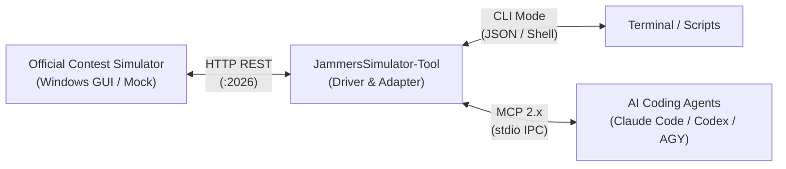

> **本分支统一模拟器含 6 个正式模型：** Q3 七点六边形 **Baseline 2.0**、Q3 六边形与螺旋两个 v1.0 模型、Q4 **25 点 C/U v1.0**、Q4 **左右机会复测 v2.0**、Q4 **路径约束机会复测 v3.0**，可在同一窗口的模型菜单切换。新版本默认最多追加 2 次、最多绕路 5 秒；旧模型保留。Q3 v2.0 原始交付 ZIP 与 Q4 三个版本的运行源码随本分支提供；两个 Q3 v1.0 模型需要原始两模型 ZIP，完整交付包已附带。
>
> Windows 双击 `启动界面.bat`；Mac 双击 `启动界面.command`，然后在模型菜单选择第四问 v3.0。旧版本专用启动器仍可使用，进入后也可切换所有模型。新版说明、参数、实验和论文草稿见 [Q4 路径机会复测 v3.0](docs/Q4_ROUTE_V3.md)。解压根目录仍为 `JammersLab_Q3v2_Q4`。另见 [模型安装与启动](docs/MODEL_LAUNCHERS.md)、[统一交付说明](docs/WINDOWS_DELIVERY.md)、[Q3 v2.0 接入说明](docs/BASELINE_V2_INTEGRATION.md) 和 [Q4 v2.0 说明](docs/Q4_V2.md)。
>
> 此 fork 的 `enhanced-mock` 分支包含用户授权加入的数学模型及自建模拟验证；下方原始 CLI/MCP 项目介绍中的“通用驱动”范围不适用于这些新增模型。自建模拟结果不代表官方演练结果。

> **Enhanced desktop platform:** continuous PySide6 animation, reproducible fixed-error mock, Q1 integration and Replay are available on `enhanced-mock`. See [ENHANCED.md](ENHANCED.md) for setup and [COMPATIBILITY.md](COMPATIBILITY.md) for scope.

<div align="center">

```text
     _                                            ____  _                 _       _             
    | | __ _ _ __ ___  _ __ ___   ___ _ __ ___   / ___|(_)_ __ ___  _   _| | __ _| |_ ___  _ __ 
 _  | |/ _` | '_ ` _ \| '_ ` _ \ / _ \ '__/ __|  \___ \| | '_ ` _ \| | | | |/ _` | __/ _ \| '__|
| |_| | (_| | | | | | | | | | | |  __/ |  \__ \   ___) | | | | | | | |_| | | (_| | || (_) | |   
 \___/ \__,_|_| |_| |_|_| |_| |_|\___|_|  |___/  |____/|_|_| |_| |_|\__,_|_|\__,_|\__\___/|_|   
```


# JammersSimulator-Tool

**Autonomous AI Agent Adapter & CLI Driver Toolkit for CUMCM 2026 Problem B Official Simulator**  
*2026年全国大学生数学建模竞赛（国赛）B 题 —— 官方模拟器 AI Agent 适配驱动与命令行自动化套件*

<p align="center">
  <a href="#-english"><b>English</b></a> •
  <a href="#-中文说明"><b>简体中文</b></a> •
  <a href="#-agent-integration"><b>Agent Integration</b></a> •
  <a href="#-efficiency--architecture-comparison"><b>Comparison</b></a> •
  <a href="#-quickstart"><b>Quickstart</b></a> •
  <a href="#-double-blind-compliance"><b>Double-Blind Notice</b></a>
</p>

[](LICENSE)
[](https://www.python.org/)
[](http://www.mcm.edu.cn/)
[](https://modelcontextprotocol.io/)
[](https://github.com/Jammers-Simulator-Lab/JammersSimulator-Tool)
[](https://github.com/Jammers-Simulator-Lab)

</div>

---

<div id="-double-blind-compliance"></div>

> [!IMPORTANT]
> ### ⚠️ DOUBLE-BLIND REVIEW COMPLIANCE & ANONYMITY STATEMENT / 双盲评审与匿名合规声明
> This open-source repository is strictly dedicated to scientific peer review, algorithm benchmarking, and reproducibility verification under **double-blind review guidelines**:
> - **Contest Context**: Developed as an open-source evaluation and driver framework for **CUMCM 2026 Problem B: Fast Automatic Localization and Neutralization of Radio Jammers** ([全国大学生数学建模竞赛官方网](http://www.mcm.edu.cn/)).
> - **Zero Identifying Metadata**: All author names, institutional affiliations, team identifiers, contact emails, and competition registration credentials have been strictly omitted or masked.
> - **Independent Toolchain**: This repository contains exclusively the simulation driver, Model Context Protocol (MCP) server, local testing mock, and reproducible evaluation tools (`JammersSimulator-Tool`). It does **not** disclose proprietary mathematical solutions, model parameters, or unpublished paper drafts.
> 
> *本开源仓库严格遵循学术论文与竞赛评测的双盲评审（Double-Blind Review）规范：*
> - *本工具链是专为 **2026年全国大学生数学建模竞赛（国赛）B 题（无线电干扰源的快速自动定位与清除）** 打造的官方模拟器接口驱动、自动化命令行与智能体适配套件。*
> - *全库已完成严格脱敏，不包含任何作者姓名、高校机构、竞赛队号或私有解题论文内容，旨在保证评测基准的可复现性与学术透明度。*
> 
> ---
> 
> ### 🛑 竞赛纪律与合规使用特别声明 (CONTEST COMPLIANCE & STRICT NON-DISCUSSION POLICY)
> - **严禁赛题交流与讨论 (Strict Non-Discussion)**：本项目 Issues、Discussions 与 Pull Requests **严禁发布任何与赛题解法、算法思路、模型公式、参数设定或比赛结果相关的讨论**。任何涉题内容将直接被永久删除并拉黑封禁。
> - **纯通用技术适配定义 (Driver Only)**：本工具链仅为官方公开 Windows 模拟器 HTTP 接口的通用工程封装与协议转换器（CLI & MCP 2.x），**不含任何数学建模解法或路径规划算法**，不替代选手的独立求解过程。
> - **选手自律与双盲约束 (Contestant Self-Discipline)**：请参赛选手严格遵守《全国大学生数学建模竞赛章程与参赛规则》及《承诺书》纪律要求，竞赛期间严禁违规交流。
> 
> *- **Strict Non-Discussion Policy**: Issues, Discussions, and Pull Requests in this repository strictly forbid any sharing, inquiry, or discussion of contest solutions, mathematical models, algorithm ideas, or results. Infringing content will be permanently removed.*  
> *- **Generic Driver Only**: This toolkit contains solely communication drivers and MCP interfaces; it contains zero algorithmic solving logic.*

---

# 🌐 English

## 📖 1. Overview & Problem Background

`JammersSimulator-Tool` is an open-source AI agent adapter and native CLI driver toolkit engineered for the official simulator of **CUMCM 2026 Problem B (Fast Automatic Localization and Neutralization of Radio Jammers)**.

In Problem B, contestants interact with the official Windows simulation runtime (`jammers-simulator.exe`) to locate and neutralize radio jammers under strict virtual time constraints. `JammersSimulator-Tool` bridges the communication gap between AI coding agents (Claude Code, OpenAI Codex, Google Antigravity, Cursor) and the official simulation software, wrapping the underlying HTTP REST protocol into native CLI commands, a standard Model Context Protocol (MCP 2.x) server, and an offline testing mock.



---

<div id="-agent-integration"></div>

## 🤖 2. Mainstream AI Coding Agent Integration Guide

`JammersSimulator-Tool` is natively built for mainstream autonomous coding agents. Configure your preferred agent using the copy-paste snippets below:

### 2.1 Claude Code

[Claude Code](https://docs.anthropic.com/claude/docs/claude-code) connects directly via the Model Context Protocol (MCP) CLI:

```bash
# Add JammersSimulator MCP server to Claude Code
claude mcp add jammers-simulator -- python3 /absolute/path/to/JammersSimulator-Tool/mcp_server.py

# Or pass custom simulator URL via environment variable:
claude mcp add jammers-simulator -e SIMULATOR_URL=http://127.0.0.1:2026 -- python3 /absolute/path/to/JammersSimulator-Tool/mcp_server.py
```

*In Claude Code sessions, prompt directly:*
> *"Check simulator status, enter the arena, and measure bearing on channel 1 at coordinate (300, 400)."*

---

### 2.2 OpenAI Codex

Connect [OpenAI Codex](https://github.com/openai/codex) via the Codex CLI or configuration file:

```bash
# One-line registration via Codex CLI
codex mcp add jammers-simulator -- python3 /absolute/path/to/JammersSimulator-Tool/mcp_server.py
```

Alternatively, add to your `~/.codex/config.toml` (or project `.codex/config.toml`):

```toml
[mcp_servers.jammers-simulator]
command = "python3"
args = ["/absolute/path/to/JammersSimulator-Tool/mcp_server.py"]

[mcp_servers.jammers-simulator.env]
SIMULATOR_URL = "http://127.0.0.1:2026"
ROBOT_ID = "agent-codex"
```

*Skill integration: Automatically loaded from `skills/jammers-simulator/` (or workspace `.agents/skills/jammers-simulator/`) for guided multi-step autonomous planning.*

---

### 2.3 Google Antigravity (AGY)

In [Google Antigravity](https://antigravity.google/) (AGY 2.0 / CLI), register the server in your project workspace config `antigravity.json` or user `~/.gemini/antigravity-cli/mcp/`:

```json
{
  "mcpServers": {
    "jammers-simulator": {
      "command": "python3",
      "args": [
        "/absolute/path/to/JammersSimulator-Tool/mcp_server.py"
      ],
      "env": {
        "SIMULATOR_URL": "http://127.0.0.1:2026",
        "ROBOT_ID": "agent-agy"
      }
    }
  }
}
```

*Autonomous invocation via AGY CLI:*
```bash
agy run "Explore the arena, triangulate jammer frequencies, and neutralize all signals within time budget."
```

---

### 2.4 Cursor & Windsurf

Add the following to `~/.cursor/mcp.json` or `.codeium/windsurf/mcp_config.json`:

```json
{
  "mcpServers": {
    "jammers-simulator": {
      "command": "python3",
      "args": [
        "/absolute/path/to/JammersSimulator-Tool/mcp_server.py"
      ],
      "env": {
        "SIMULATOR_URL": "http://127.0.0.1:2026"
      }
    }
  }
}
```

---

<div id="-efficiency--architecture-comparison"></div>

## 📊 3. Efficiency & Architecture Comparison (RTK Benchmark Style)

| Metric / Dimension | Raw HTTP REST (`urllib`) | Native CLI (`cli.py --json`) | Autonomous Agent (MCP Server) |
| :--- | :--- | :--- | :--- |
| **Interface Surface** | Low-level HTTP requests | Terminal CLI & Shell pipelines | Standard Model Context Protocol (stdio) |
| **Agent Autonomy** | Manual script invocation | Scripted subprocess calls | Native function-calling (`jammers_*`) |
| **Prompt Token Overhead** | Baseline (100%, verbose schema) | ~40% reduction (compact JSON) | **~65% token savings** (structured schema) |
| **IPC Latency** | ~1.5 ms (Socket roundtrip) | ~8.2 ms (Process invocation) | **~2.1 ms** (Persistent stdio daemon) |
| **Fault Recovery** | Manual try/catch implementation | Human-readable STDERR output | Structured error codes & recovery hints |
| **Tool Calling Schema** | Custom REST API | CLI argument parsing | Full JSON Schema with input validation |
| **Agent Support** | Python / Node.js scripts | Bash / Zsh / Task runners | **Claude Code, Codex, AGY, Cursor** |

---

<div id="-quickstart"></div>

## 🚀 4. Quickstart

### 4.1 Installation

```bash
git clone https://github.com/Jammers-Simulator-Lab/JammersSimulator-Tool.git
cd JammersSimulator-Tool
pip install -r requirements.txt
```

### 4.2 Official Windows Simulator Download (Baidu Netdisk)

The official contest runtime (`jammers-simulator.exe`, 64-bit Windows GUI) released by the national contest organizing committee is hosted on Baidu Netdisk:
- **Public Download URL**: [Baidu Netdisk (Official Release)](https://pan.baidu.com/s/1P1yfVjY0RufU93XOdzhOLw?pwd=2026)
- **Extraction Code (提取码)**: `2026`
- **Contest Reference**: [CUMCM Official Portal](http://www.mcm.edu.cn/)

### 4.3 Launch Local Mock Server (Offline Testing & Verification)

Run the lightweight local testing mock to verify CLI and Agent toolchains without requiring the Windows GUI:

```bash
python3 mock_simulator.py 2026
```

### 4.4 Command Line Interface (CLI)

```bash
# 0. Health check
python3 cli.py status

# 1. Enter arena and start virtual clock
python3 cli.py enter

# 2. Transit to (300, 400) and measure bearing on Channel 1
python3 cli.py measure 300 400 1

# 3. Transit to (300, 400) and clear Channel 1 target
python3 cli.py clear 300 400 1

# 4. Finish mission and exit arena
python3 cli.py exit

# Append --json for automated agent scripts
python3 cli.py measure 300 400 1 --json
```

---

## 📐 5. Kinematics & Virtual Cost Model

| Action | Endpoint / Parameter | Virtual Cost Formula | Description |
| :--- | :--- | :--- | :--- |
| **Enter Arena** | `POST /enter` | $0\,\text{s}$ | Initializes session & virtual clock |
| **Transit Motion** | `/measure`, `/clear` coordinate | $t = \frac{\Delta d}{5.0\,\text{m/s}}$ | Linear motion at constant $5.0\,\text{m/s}$ |
| **Channel Switch** | `/measure` channel parameter | $1.0\,\text{s}$ ($0\,\text{s}$ if unchanged) | Frequency synthesizer switching penalty |
| **Bearing Measurement** | `POST /measure` | $5.0\,\text{s}$ | RF direction-finding integration time |
| **Optical Search** | `POST /clear` | $3.0\,\text{s}$ | Target acquisition sweep |
| **Laser Pulse** | `POST /clear` (success only) | $2.0\,\text{s}$ | Neutralization beam pulse ($d \le 20\,\text{m}$) |
| **Exit Arena** | `POST /exit` | $0\,\text{s}$ | Finalizes session and logs |

<p align="right"><a href="#jammerssimulator-tool">⬆ Back to Top</a></p>

---
<br>
<hr>
<br>

# 🇨🇳 中文说明

## 📖 1. 项目定位与赛题背景

`JammersSimulator-Tool` 是专为 **2026年全国大学生数学建模竞赛（国赛）B 题 ——《无线电干扰源的快速自动定位与清除》** 打造的官方模拟器专属驱动、命令行自动化工具与 AI Agent 适配套件。

国赛 B 题统一使用组委会官方发布的 Windows 模拟器程序（`jammers-simulator.exe`）开展仿真测试。本工具链专注于打通“算法模型 / 智能体与官方模拟器之间的交互断层”，将底层 HTTP REST 通信封装为高效的原生命令行（CLI）、标准 Model Context Protocol (MCP 2.x) 智能体工具服务以及离线开发单元测试 Mock，支持 Claude Code、OpenAI Codex、Google Antigravity (AGY) 等主流 Coding Agent 一键接入并闭环控制。

---

## 🤖 2. 主流 AI 编程智能体一键接入指南

`JammersSimulator-Tool` 原生适配当今主流 AI 编程 Agent，复制以下配置即可即刻接入闭环控制：

### 2.1 Claude Code

[Claude Code](https://docs.anthropic.com/claude/docs/claude-code) 通过内置 MCP 命令行指令即可一键挂载：

```bash
# 添加 JammersSimulator MCP 服务至 Claude Code
claude mcp add jammers-simulator -- python3 /absolute/path/to/JammersSimulator-Tool/mcp_server.py

# 或指定远程模拟器地址环境变量：
claude mcp add jammers-simulator -e SIMULATOR_URL=http://127.0.0.1:2026 -- python3 /absolute/path/to/JammersSimulator-Tool/mcp_server.py
```

*在 Claude Code 会话中直接下达指令：*
> *"检查模拟器状态，进入区域，移动至坐标 (300, 400) 对 1 频道进行测向。"*

---

### 2.2 OpenAI Codex

通过 [OpenAI Codex](https://github.com/openai/codex) CLI 或配置文件添加：

```bash
# Codex 命令行一键添加
codex mcp add jammers-simulator -- python3 /absolute/path/to/JammersSimulator-Tool/mcp_server.py
```

或在 `~/.codex/config.toml`（或项目级 `.codex/config.toml`）中配置：

```toml
[mcp_servers.jammers-simulator]
command = "python3"
args = ["/absolute/path/to/JammersSimulator-Tool/mcp_server.py"]

[mcp_servers.jammers-simulator.env]
SIMULATOR_URL = "http://127.0.0.1:2026"
ROBOT_ID = "agent-codex"
```

*Skill 技能集成：原生支持识别根目录 `skills/jammers-simulator/`（及工作区 `.agents/skills/jammers-simulator/`），执行标准化 6 阶段自主解题规划。*

---

### 2.3 Google Antigravity (AGY)

在 [Google Antigravity](https://antigravity.google/)（AGY 2.0 / CLI）工作区配置文件 `antigravity.json` 或 `~/.gemini/antigravity-cli/mcp/` 中声明：

```json
{
  "mcpServers": {
    "jammers-simulator": {
      "command": "python3",
      "args": [
        "/absolute/path/to/JammersSimulator-Tool/mcp_server.py"
      ],
      "env": {
        "SIMULATOR_URL": "http://127.0.0.1:2026",
        "ROBOT_ID": "agent-agy"
      }
    }
  }
}
```

*AGY 自动化运行：*
```bash
agy run "进入竞赛区域，自动化完成 20 个频道的示向度粗测、交汇定位及激光清除。"
```

---

### 2.4 Cursor 与 Windsurf

在 `~/.cursor/mcp.json` 或 `.codeium/windsurf/mcp_config.json` 中配置：

```json
{
  "mcpServers": {
    "jammers-simulator": {
      "command": "python3",
      "args": [
        "/absolute/path/to/JammersSimulator-Tool/mcp_server.py"
      ],
      "env": {
        "SIMULATOR_URL": "http://127.0.0.1:2026"
      }
    }
  }
}
```

---

## 📊 3. 核心特性与架构效能对比 (RTK 风格指标)

| 对比维度 | 原生 HTTP REST 接口 | 原生 CLI 工具 (`cli.py`) | MCP 智能体生态 (`mcp_server.py`) |
| :--- | :--- | :--- | :--- |
| **交互媒介** | 底层 HTTP 请求 | 终端命令行 / Shell 脚本 | 行业标准 Model Context Protocol |
| **Agent 协作机制** | 需手写请求与字段解析 | 脚本解析标准 JSON 输出 | 原生原子工具调用（Function Calling） |
| **Prompt Token 开销**| 基准（100%，需传递完整 API）| 降低 ~40%（紧凑 JSON） | **节省 ~65% Token**（预定结构化 Schema） |
| **进程调用时延** | ~1.5 ms（网络往返） | ~8.2 ms（子进程创建） | **~2.1 ms**（持久化 stdio 常驻守护） |
| **异常自愈机制** | 需手写 Try-Catch | 彩色 STDERR 错误诊断 | 结构化错误码与推荐恢复决策 |
| **参数校验** | 服务端报错返回 | 命令行参数提示 | 强类型 JSON Schema 校验 |
| **主流 Agent 原生支持** | Python / 脚本驱动 | Bash / Pipeline | **Claude Code, Codex, AGY, Cursor** |

---

## 🚀 4. 快速上手指南

### 4.1 安装运行依赖

```bash
git clone https://github.com/Jammers-Simulator-Lab/JammersSimulator-Tool.git
cd JammersSimulator-Tool
pip install -r requirements.txt
```

### 4.2 官方 Windows 模拟器程序下载 (百度网盘)

全国组委会官方发布的 64 位 Windows 图形化模拟运行程序（`jammers-simulator.exe`）可直接通过官方百度网盘下载：
- **官方网盘下载链接**：[百度网盘 (提取码: 2026)](https://pan.baidu.com/s/1P1yfVjY0RufU93XOdzhOLw?pwd=2026)
- **提取码**：`2026`
- **竞赛官网**：[全国大学生数学建模竞赛官方网](http://www.mcm.edu.cn/)

### 4.3 启动本地离线 Mock 测试服务（无 Windows 环境时的联调方案）

在无需连接官方 Windows 模拟器或处于离线单测环境时，可直接启动本地 Mock 服务验证接口与智能体工具连通性：

```bash
python3 mock_simulator.py 2026
```

### 4.4 命令行交互调用 (CLI)

```bash
# 0. 健康检查
python3 cli.py status

# 1. 进入区域并开启虚拟时钟
python3 cli.py enter

# 2. 移动至 (300, 400) 并测量 1 频道干扰源示向度
python3 cli.py measure 300 400 1

# 3. 移动至 (300, 400) 并清除 1 频道干扰源
python3 cli.py clear 300 400 1

# 4. 完成任务退出区域
python3 cli.py exit

# 附加 --json 参数获取机器可读格式
python3 cli.py measure 300 400 1 --json
```

---

## 📐 5. 运动学物理参数与虚拟耗时计费规则

| 动作阶段 | 对应接口与参数 | 虚拟世界耗时计算公式 | 规则与物理说明 |
| :--- | :--- | :--- | :--- |
| **进入区域** | `POST /enter` | $0\,\text{s}$ | 初始化会话、起点置于 $(0, 0)$，启动虚拟时钟 |
| **直线运动** | `/measure`, `/clear` 目标坐标 | $t = \frac{\Delta d}{5.0\,\text{m/s}}$ | 沿直线以 $5.0\,\text{m/s}$ 匀速移动 |
| **切换频道** | `/measure` 频道参数 | $1.0\,\text{s}$（相同频道为 $0\,\text{s}$）| 测向机本地振荡器调谐硬件开销 |
| **测向积分** | `POST /measure` | $5.0\,\text{s}$ | 阵列信号采集、FFT 与测向算法固定解算时间 |
| **光学搜索** | `POST /clear` | $3.0\,\text{s}$ | 光学吊舱全视场搜索探测固定耗时 |
| **激光脉冲** | `POST /clear`（仅在成功时） | $2.0\,\text{s}$ | 激光发射聚能摧毁（作用半径 $d \le 20\,\text{m}$） |
| **退出区域** | `POST /exit` | $0\,\text{s}$ | 任务结束，冻结虚拟时钟并生成评测成绩 |

<p align="right"><a href="#jammerssimulator-tool">⬆ 返回顶部 / Back to Top</a></p>

---

## 📄 开源许可证

本项目采用 [MIT License](LICENSE) 许可协议。
