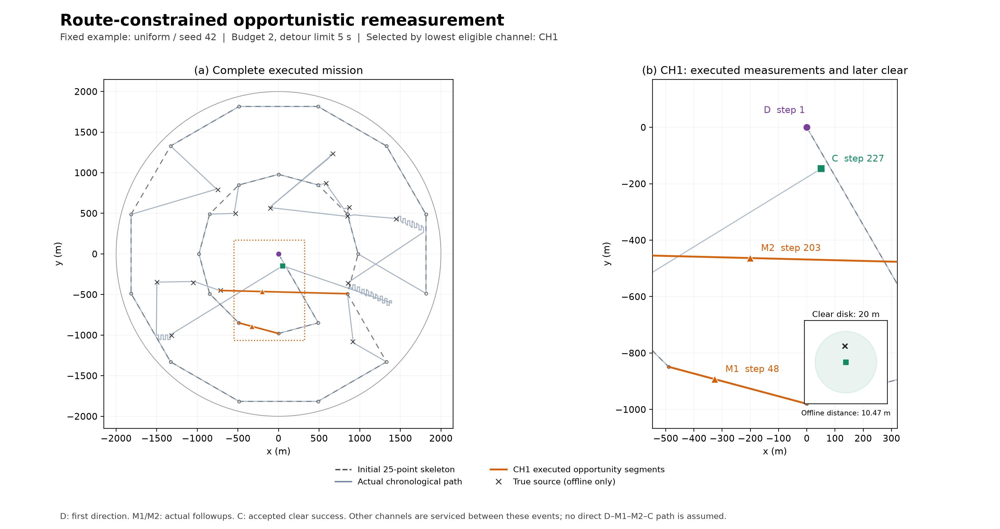

# 第四问：路径约束机会复测

本文是基于现有模型的论文说明草稿。第13节已补入冻结代码下30个共同场景、
210次真实执行的正式结果；数值评分与理论费用不代替实际成绩。

本轮重新核对的论文主干为
[`main@3d3e68573cdb50afd5c96d896c7b08c115566227`](https://github.com/lkx15501261539-cyber/CUMCM-2026/commit/3d3e68573cdb50afd5c96d896c7b08c115566227)。
该版本第三问已采用七点六边形 Baseline v2.0、完整历史、响应分箱及带后继费用的
C/U 模型；第二问实际求解器位于 `code/baseline_v2/solver.py`。
本轮模拟器工作基于 `enhanced-mock` 的已有 Q4 v2.0；修改前本地基线提交为
`e8410ffb054768fa328014f29a782dac6b61d446`。旧版代码、模型入口及试验结果独立保留。

记号沿用论文：频道为 $k$，信息更新序号为 $\ell$，$P_k^\ell$ 为纯测向楔形交，
$F_k^\ell$ 为融合物理约束的位置可行域，$E_k^\ell\supseteq F_k^\ell$ 为认证外包。
当前位置和当前测向频道分别记为 $p^\ell,c^\ell$；其中 $c^\ell$ 对应论文中的
$c_{\mathrm{radio}}$，不与论文表示最小包围圆圆心的 $c_k^\ell$ 混用。
$\sigma_k^\ell$ 表示频道状态，$r_k$ 表示首次发现以后剩余的追加测量次数。
$J_k$ 保留为定位损失，$\widehat C,\widehat U$ 为时间成本，总耗时记为 $T$。
$U_k^*$ 仍指停止无线电后理论最优的保证清除成本，$\widehat U_k$ 是已经构造且
可执行的上界；$V/C$ 仍指含后续观测反馈和光学收尾的闭环源任务成本。
本轮复用已有接口及其保守近似，不把数值 $\widehat J$ 直接换算为保证节省的秒数。

## 1. 几何最优测点与总时间目标

第二问在保证接收区域内寻求纯定位损失较小的测点。其连续目标为

\[
J_k^\star=\inf_{S\in\mathcal C_{\mathrm{rx},k}^\ell}J_k(S).
\]

目前求解器产生有限候选上的数值近似，不能称为已经求得连续全局最优。
多源任务还必须计入移动、换频、检测和清除。速度为 $5\,\mathrm{m/s}$ 时，
额外绕行 200 米就需要 40 秒，因此改善局部交会几何不必然减少整个任务的耗时。

旧 Q4 v2.0 要先在未来骨架点中找到整域认证的左右对。首次测向留下的 F 很长，
真实近端位置可能破坏左右角宽条件。例如 $S_0=(0,0)$、示向度 $0^\circ$ 时，
$X=(10,0)$ 仍可行；两内圈点 $(848.705,\pm490)$ 的相对偏角约为
$\mp149.705^\circ$，角宽约 $299.410^\circ>180^\circ$。
这不是仅靠提高外包精度就能消除的误拒。
没有左右对时，原 Q4 的保守 C4 又把新方向分支按原 F 收尾，难以体现信息收益，
于是出现首次发现后始终未复测、直接进入大量光学尝试的情况。

## 2. 路径约束机会复测

令当前剩余计划为 $\Gamma$，其中确定的搜索点和已认证清除点构成折线
$\Gamma_{\mathrm{search}}=\bigcup_j[A_j,B_j]$。
新方案先在该折线上寻找测点，再考虑小绕行，最后才考虑原 Q2 的主动选点或 U。
代表位置只参与候选生成和排序，不作为真实源位置。

旧左右机会复测模型完整保留，可以独立切换和比较。严格左右对不再是本版允许
追加测量的必要条件；普通候选只需通过距离接收认证，再接受有限预算和收尾规则。
机会测量优先是一项明确的调度策略，不表述为每次都优于立即光学的最坏情况定理。

## 3. 路线与保证接收区域的交集

利用全部已成功测向的位置，定义位置相关的接收半径下界

\[
R_{k,\min}^\ell(X)=\max\left\{1000,
\max_{(S_i,\theta_i)\in\mathcal D_k^\ell}\|X-S_i\|\right\},
\qquad
\mathcal C_{\mathrm{rx},k}^\ell=
\bigcap_{X\in F_k^\ell}B(X,R_{k,\min}^\ell(X)).
\]

该区域对全向源保证接收；对 Q4 定向源只保证不会因距离过远而失联。
它是闭圆盘族的交，因而为凸集。沿某段令 $S(t)=A+t(B-A)$，$0\le t\le1$。
若两个参数端点通过整域接收认证，则凸性保证它们之间整个子段属于
$\mathcal C_{\mathrm{rx},k}^\ell$。

实现复用 E 的有理多边形与物理切平面。对每一多边形 $Q$，可分别使用

\[
\max_{X\in Q}\|S-X\|^2
\le\max\left\{1000^2,\max_i\min_{X\in Q}\|S_i-X\|^2\right\}
\]

或对某一成功位置 $S_i$ 证明

\[
\|S-X\|^2-\|S_i-X\|^2\le0,\qquad X\in Q.
\]

前者利用凸距离平方的顶点最大值，后者的差为 X 的仿射函数，均可连续验证。
有限探测和二分只负责寻找获证端点；没有找到交段，不能据此宣称真实交集为空。
实际发送的毫米坐标仍需再次认证。理想在线段上的点零绕行；取整导致的额外移动
至多为 $\sqrt2/1000$ 米，其实际值逐动作记录。

## 4. 路线附近的低绕行候选

没有找到可用路线内候选时，考察附近位置 S，其单点插入增量为

\[
\Delta t_{\mathrm{move}}(S;A,B)=
\frac{\|A-S\|+\|S-B\|-\|A-B\|}{5}.
\]

先要求整域接收证书成立且 $\Delta t_{\mathrm{move}}\le\tau_{\mathrm{route}}$，
再按 $\widehat J_k(S)$ 选择，避免引入没有物理解释的距离—精度加权系数。
本轮实验比较不同 $\tau_{\mathrm{route}}$，应用默认配置为 5 秒，结果见第13节。

$\tau_{\mathrm{route}}$ 是相对指定相邻点的单次移动增量，不是所有预约共同的
总绕行预算。多个点分别满足该阈值，并不保证合并路线仍满足同一阈值。
因此预约随真实反馈更新，真正执行前须按当前相邻任务重新核验；进入 U、插入
清除点或移动起点以后，旧邻接关系下的增量不能冒充新计划的边际费用。

## 5. 在受限候选集中复用 J

对未测过的候选 S 和合法位置 X，正常读数为
$\theta^{\mathrm{new}}=\operatorname{wrap}_{360}(\beta(X,S)+\varepsilon)$。
继续使用第二、三问的损失：

\[
\mathcal L_k(S,X,\varepsilon)=
\begin{cases}
+\infty,&S\text{ 已在该频道测过},\\
0,&\|X-S\|\le5,\\
D\!\left(P_k^\ell\cap W(S,\theta^{\mathrm{new}})\right),&\text{正常分支}.
\end{cases}
\]

近距离零损失表示随后成功清除后的定位损失，不表示已获得源坐标。
在 Q4 中，该几何评分也不承诺近点必然可见；`no_signal` 另由有限策略和 U 处理。
无界交集为无穷损失，空交集或数值异常不能记作零。

在从 F/E 生成且通过可行性检查的有限位置集及有界误差端点等样本上计算

\[
\widehat J_k(S)=\max_{X_j,\varepsilon_r}\mathcal L_k(S,X_j,\varepsilon_r).
\]

它只用于排序。即使单次几何计算准确，有限采样最大值也是连续最坏值的下估计，
不是上界。评分样本与接收证书分离，不能以样本通过代替连续认证。
候选仅来自历史及 F/E；程序不读取真实位置、真实接收半径或真实发射朝向。

加速实现加载原 Q3 v2 ZIP 中未修改的 `solver.pure_diameter`，由现有 Q1 按当前
Q4 的 $1.005^\circ$ 半角构造半平面；缺少 NumPy 或原求解器无法加载时使用 Q1 有理几何。
额外 $0.005^\circ$ 是两位小数读数的量化余量，不改变原 Q3 冻结求解器的
$1^\circ$ 参数，也不把它隐蔽混入原 Q3 模型。

路线和附近均不可用时，原 Q2 有限全域候选搜索作为昂贵后备。
生产策略仍须由原 C/U 判断主动测向是否值得；专门的全域 Q2 消融组可放宽路径
阈值，以便比较候选位置变化，而不能把它称为求出了连续全局最优策略。

## 6. 有限复测预算

首次 `direction` 属于发现阶段，不扣追加次数。其后设 $r_k=b$，实验比较
$b\in\{1,2,3\}$，初始配置取 $b=2$。每次实际接受的追加测量均令
$r_k\leftarrow r_k-1$，包括 `direction/near/no_signal`；幂等重试不重复扣减。
重规划、新方向或新的预约均不能重新发放预算。

后续复测优先使用路线内或低绕路点。已经追加测过而没有这类候选时，停止追逐
远处几何最优点，进入 U。同地点同频道读数固定，已测毫米坐标始终排除，不能把
重复测量当作独立误差的信息增益。

## 7. 新信息后的滚动重规划

每次只执行一个真实动作。发现新频道、复测返回、清除成功、完成搜索点或进入
光学阶段后，更新状态、当前位置、当前频道和待完成任务，再计算下一动作。
搜索批次中的每个频道也有独立的实际扫描记录。

预约包含目标频道、测点、级别、定位评分及所依附的路线段。路线改变后重新映射
或取消预约；旧证明可继续证明距离安全，并不保证旧路线增量仍有效。
新方向导致 P/F/E 更新时重建几何缓存；距离安全失联只更新已测点排除和次数，
不将旧 P 缓存与新的方向历史混合。

## 8. 代表中心与保证清除点

几何中心或最小包围圆中心可以帮助判断源靠近哪段路线，但始终是规划代表位置。
只有存在实际发送点 $\widetilde q$ 并且经过认证满足

\[
\sup_{X\in F_k^\ell}\|\widetilde q-X\|\le20
\]

时，才建立单点保证清除任务。允许对覆盖 F 的有理外包证明该条件；不要求纯 P
先变得很小，也不把可能无界的 P 当作光学区域。
两条示向度的交会中心不能自动获得清除资格，直径不超过 40 米也不单独构成证书。
候选圆心采用浮点数生成时，最终接收与否仍由取整后逐顶点有理距离检验决定。

## 9. Q4 的距离安全失联判别

若 FOUND 频道在经过 $\mathcal C_{\mathrm{rx},k}^\ell$ 认证的点返回 `no_signal`，
则距离原因已被排除：在本题静态源、固定半径及接口正确的前提下，可记录
`directional_confirmed`。不能将该频道改为 ABSENT。

该标记只是类型和当前不可见性的判断，不是发射朝向的估计。本版不根据它删除
附近 F，不用连续失联拟合 $\phi$，不增加位置—半径—朝向概率模型。
Q3 全向模式下同样的响应应报告模型、数值或接口异常，不能当作普通位置排除。

## 10. 连续失联与确定性光学后备

预算为零、连续失联达到阈值，或后面不再有允许的低成本位置时，停止无线电推断。
默认连续失联阈值为两次，并受总追加预算限制。
使用已有 $\widehat U_k$ 保存的认证有限路线，要求

\[
F_k^\ell\subseteq E_k^\ell\subseteq\bigcup_iB(\widetilde q_i,20).
\]

一旦进入光学阶段，不因重规划恢复测向或重新生成无限尝试序列。
每次只执行当前覆盖路线的一个点，失败后移除已完成尝试，成功才标记 CLEARED。
光学覆盖与发射方向无关；其保证依赖 E 保留真源以及模拟器遵守距离清除规则。
完整覆盖耗尽仍未成功必须报告异常，不能伪造完成。

## 11. 清除插入与完整费用评价

对已认证单点 q，单独插入 $A\to B$ 的费用为

\[
\Delta T_{\mathrm{clear}}=
\frac{\|A-q\|+\|q-B\|-\|A-B\|}{5}+5.
\]

多个清除、复测或光学任务共存时，比较完整计划的费用差
$\Delta_k=\overline T(\Gamma')-\overline T(\Gamma)$。
光学可能在不同位置首次成功，不能把预测中心当作固定服务终点。
可执行的保守接回策略或完整后继费用应明确计入，而不是只用普通 TSP 四边公式。

逐动作总时间始终为

\[
T=\frac{L_{\mathrm{move}}}{5}+N_{\mathrm{sw}}
+5N_{\mathrm{meas}}+3N_{\mathrm{clr}}+2N_{\mathrm{succ}}.
\]

“一次测量约 5–6 秒”不是一般的完整插入增量。若从频道 a 切到 k 又切回 a，
可能多花 7 秒；清除本身不改变当前测向频道。实际动作日志与模拟器累计时间
逐次核对，候选评分不能代替计时结果。

## 12. 正确性与有限停止的范围

25 点骨架仍用原点、980 米内圈、1880 米外圈，外层错开 $15^\circ$。
其整数毫米证书证明方向发现覆盖。只对 UNKNOWN 做存在性扫描；FOUND 的复测
另行计数。只有某 UNKNOWN 在全部 25 点真正完成检测且均失联，才可标 ABSENT。
成功清除 16 个不同频道后可按源数上限提前退出；否则必须完成剩余存在性检查
和已发现源处理。

每个频道—搜索点至多扫描一次，每源追加次数有固定上限，每源光学后备为有限
序列且实际执行后减少。这些进度条件支持有限停止。它们不自动证明在题目的
真实时间或虚拟时间上限内一定清除全部源，也不证明本版总时间优于所有旧版。

严格保证与近似评价必须区分：

| 内容 | 范围 |
| --- | --- |
| 25 点方向发现覆盖 | 现有实际坐标及整数毫米几何证书 |
| 距离安全、实际 20m 清除覆盖 | 保守有理外包上的连续认证；沿用 Q1 有理化三角系数约定 |
| 有界误差和固定同点读数 | 模型与模拟器规则，不假设独立随机误差 |
| 路径内候选与低绕行阈值 | 对当前实际邻接段及发送坐标复核的单点条件 |
| $\widehat J$、有限候选最优 | 数值排序，不是连续最坏损失上界或全局最优证明 |
| C/U 后备与完整计划评价 | 所声明的具体收尾及接回策略；不冒充实际未知任务终点 |
| 性能改善与推荐参数 | 只能由本轮同场景执行日志支持 |

## 13. 仿真、消融与论文图表

正式比较采用种子42–47和uniform、center-biased、boundary-biased、clustered、
repulsive五种分布，共30个几何场景。每种策略使用相同的源位置、数量、半径、
类型、朝向、固定误差场与初始25点搜索路线。误差采用模拟器的确定性
`worst_edge`：真实误差为 $\pm1^\circ$，读数量化到两位小数。

当前Q4 v2.0就是左右机会复测版，二者合并为同一个 `pair_v2` 基线；
本批没有把它伪造为两组独立对照，也没有将旧Q4 v1.0算入七组正式结果。
新策略比较追加预算1/2/3（绕路阈值5秒）、预算2时阈值0/20秒，以及预算2的
全域有限Q2候选消融。在线策略仅收到接口反馈；隐藏真值只用于离线核验与绘图。

210局全部完成，每策略清除360/360源次。独立重新核对了114609个已接受动作：
逐动作计时、移动与换频、预算、复测次数和延迟、真实20米清除距离均一致；
所有距离安全 `no_signal` 判别对应离线真值中的定向源。运行前后源码哈希一致。
这支持本批测试结论，不替代第12节中各连续几何证书的证明。

下表的T、移动、clear次数与CPU均为30场等权平均；“无复测”和“进入U”是
360源次中的总量。更完整的20项指标、逐场差值和逐源原因见
[独立分析](q4-route-v3-results/analysis.md)、[分析JSON](q4-route-v3-results/analysis.json)
和[汇总CSV](q4-route-v3-results/summary.csv)。

| 策略 | 场均T（秒） | 场均移动（米） | 场均clear | 追加复测总次 | 无复测源次 | 进入U源次 | CPU秒/场 |
| --- | ---: | ---: | ---: | ---: | ---: | ---: | ---: |
| 旧v2左右机会 | 13957.76 | 51041.49 | 732.83 | 0 | 360 | 360 | 1.19 |
| 路径：预算1、τ5 | 9175.09 | 34630.64 | 206.13 | 349 | 11 | 276 | 19.61 |
| 路径：预算2、τ5 | 9359.50 | 35587.01 | 185.63 | 603 | 16 | 143 | 17.78 |
| 路径：预算3、τ5 | 9378.17 | 35667.01 | 183.10 | 660 | 16 | 127 | 18.23 |
| 路径：预算2、τ0 | 9379.41 | 35667.69 | 187.63 | 596 | 19 | 144 | 18.08 |
| 路径：预算2、τ20 | 9315.59 | 35403.78 | 183.10 | 609 | 13 | 141 | 17.20 |
| 主动Q2：预算2 | 10131.39 | 39026.11 | 211.70 | 631 | 0 | 118 | 6.83 |

预算2、τ5相对旧v2在30场全部更快，平均少4598.26秒；“逐场相对降幅的平均”
为32.31%，“平均T的相对降幅”为32.94%，两种口径不能混用。最小改善是
boundary-biased、seed43，仍少1390.77秒（12.55%）。相对主动Q2则为21场更快、
9场更慢，平均少771.89秒；上述两种降幅分别为7.12%和7.62%。最差反例为
repulsive、seed45，路径策略多1633.95秒（18.38%）。不能写成每场均优于主动Q2。

按实际执行候选池化的 $\widehat J$ 均值，预算2、τ5为99.55米，主动Q2为84.76米；
执行前认证的单次边际移动时间累计到每场，其均值分别为0.57秒和1261.74秒。
这批数据体现了“较差的局部定位评分仍可伴随较短的总任务时间”。但两策略随后
获得的F和经过的路线不同，这不是相同F下逐点配对的纯J实验。评分仍是有限采样
的数值量，不是连续最坏界；局部绕路累计也不等于完整任务移动差。

预算1→2使每场clear减少20.50次，但总移动增加956.37米，加上检测与换频后，
场均T反而增加184.41秒（2.01%），30场中19场更慢。预算3相对2仅增加18.67秒
（0.20%），不宜夸大该小差异。在预算2下，τ0与τ5有25场T相同，τ20与τ5有21场
相同；τ20平均仅少43.91秒（0.47%），不支持宣称更宽阈值普遍更优。

**应用默认仍保留追加2次、τ5秒。** 若按本批完整任务T优先选参，建议手动选择
追加1次、τ5秒，它是七个已测配置中场均T最小者；预算2是光学尝试更少的选项。
预算1与τ0/20的组合没有测试，不能称预算1、τ5为联合参数全局最优。

首次复测延迟仍是明确限制。预算2、τ5有344/360源次实际复测；其等待从首次
`direction`返回到首次复测开始计算，均值2907.92秒、中位2101.85秒，123源次
超过1小时。最长为center-biased、seed47、CH11：第11步发现并预约，第617步
才实际复测，等待11192.99秒、累计移动43329.95米。未复测的16源次全部记录为
`no_route_candidate`，其中15个曾经预约，后来进入U并清除。因此“直到清除都
完全未复测”大幅减少，但“首次发现后长期等待复测”尚未解决；预约不等于执行。

第一次复测成功率按实际尝试池化，为268/344（77.91%）；第二次为165/259
（63.71%）。未尝试者不记成零成功率。该配置有217源次在机会复测后取得认证
单点清除，143源次进入U；定向判别170次、涉及106个去重场景源。主动Q2另有
242源次经主动复测取得认证清除点，不能因其不属于“路线机会”而误报为零定位成功。

CPU是含预热与构造的进程耗时，和墙钟分别记录，不是虚拟T。四进程实验中，
预算2、τ5的场均CPU/墙钟为17.78/17.98秒，旧v2为1.19/1.20秒。不同缓存状态
及机器负载会影响现实耗时，本批未对运行速度做重复计时的统计推断。

论文图表已由实际结果生成：[总时间、移动与clear](q4-route-v3-results/completed_task_comparison.png)、
[移动与追加次数](q4-route-v3-results/movement_vs_remeasurement.png)、
[预算与绕路阈值](q4-route-v3-results/budget_and_detour_ablations.png)、
[首次复测诊断](q4-route-v3-results/first_remeasurement_diagnostics.png)。
各图都有同名SVG，清单与口径见[图表目录](q4-route-v3-results/README.md)。



典型轨迹固定采用uniform、seed42、预算2、τ5，并按“机会复测后获得认证清除点
且实际成功的最低频道”选择CH1，没有按最大收益挑选。D、M1、M2、C对应第1、
48、203、227个实际动作，途中仍处理其他频道；两段橙色A-S-B均与相邻已接受
回执核对。完整图注及输入哈希见[轨迹说明](q4-route-v3-results/uniform42_route_b2_t5_actual_trajectory.caption.txt)
和[来源记录](q4-route-v3-results/uniform42_route_b2_t5_actual_trajectory.json)。

## 运行与交付

Mac 双击 `启动界面.command`，Windows 双击 `启动界面.bat`，在同一个模型菜单
选择“第四问 · 路径约束机会复测 · v3.0”。所有正式模型都在该窗口切换；
窗口内可设置追加预算及最多绕路秒数。旧压缩包不会自动更新，新代码应从本次统一包
或本仓库 `enhanced-mock` 分支取得。环境安装继续使用已有启动脚本。

以下命令均在模拟器仓库根目录、已安装 `requirements-q3-v2.txt` 的 Python 环境执行。
直接运行一个问题四场景并保存完整可回放日志：

```sh
python -m enhanced q4 --model q4_route_v3 --problem 4 --seed 42 --scenario uniform --error-model worst_edge --extra-budget 2 --tau-route 5 --output runs/q4-route-42
```

接口适配验证可启动 HTTP 模拟器，并在另一个终端运行相同控制器：

```sh
python -m enhanced serve --problem 4 --seed 42 --error-model worst_edge --port 2027 --output runs/q4-route-server-42
```

```sh
python model_sources/q4/route_opportunistic_remeasure.py --url http://127.0.0.1:2027 --extra-budget 2 --tau-route 5 --output runs/q4-route-client-42
```

只检验全向协议时，可对 `q4_route_v3` 指定 `--problem 3`。这不改变原 Q3 的
七点法入口；原 Q3 数学代码及 ZIP 字节仍保持不变。

```sh
python -m pytest -q
python tools/q4_compare.py --jobs 4 --output experiments/q4-route-30x7.json --plots
```

对照工具默认使用种子 42–47、五种分布，合并当前 v2 与左右版为同一基线，
比较预算 1/2/3（绕路 5 秒）、预算 2 的绕路 0/20 秒，以及全域有限 Q2 点消融，
共 30 个共同场景、210 次运行。图表另外需要 `matplotlib`，GUI 不依赖它。
失败场景保留在结果里；JSON、逐场 CSV、逐源 CSV、汇总 CSV 和原始回放一并输出。
现实 CPU 时间含控制器构造和评分器准备，预热部分另列，与虚拟 T 分开统计。

代码结构仍以已有模块为主体：唯一新增运行模块为
`model_sources/q4/route_opportunistic_remeasure.py`；连续候选证书扩展在原
`opportunities.py`，评分器加载冻结的 Q3 ZIP 内 `solver.pure_diameter`。
原 `q4.py/cu.py/第一问.py` 的 SHA256 未变。界面、命令行、适配器和比较器均在
原文件中扩展；新增测试分别覆盖几何、控制器和独立统计。

本轮成果入口、验证版本与尚未覆盖的范围集中见
[Q4 v3交付说明](Q4_ROUTE_V3_DELIVERY.md)。本页的实验数据对应冻结配置；
后续重新运行请使用新的输出目录，避免覆盖已有原始证据。
